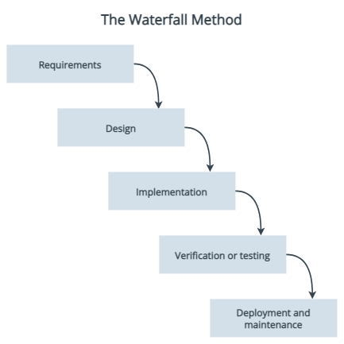
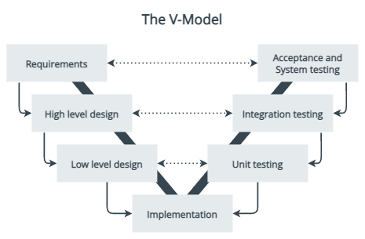
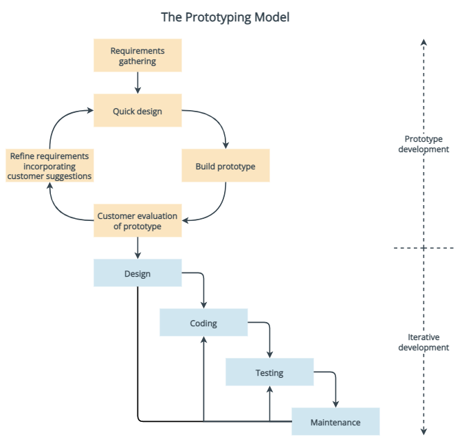
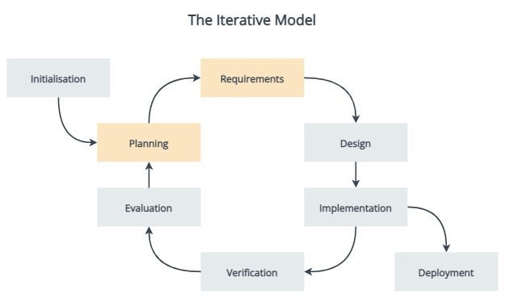
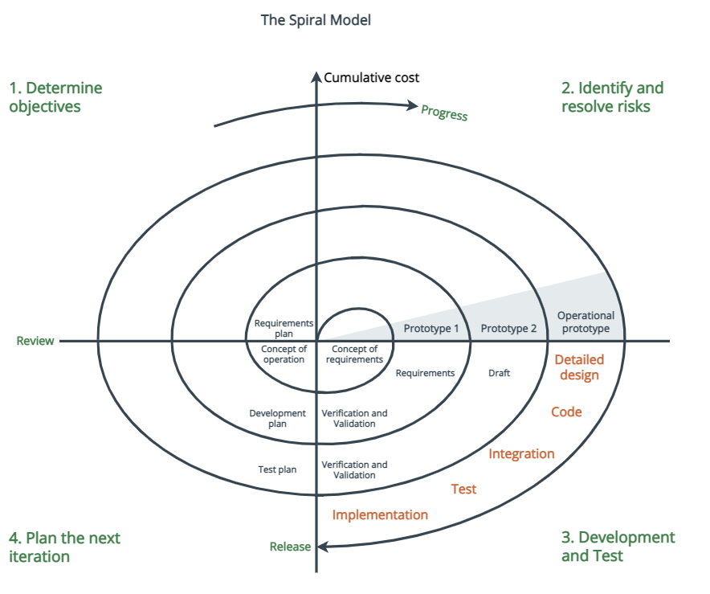
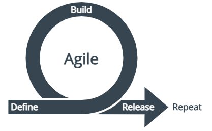

<!-- # Training 04 - Agile & Lean -->
# Software development lifecycle (SDLC) methods

A software development lifecycle is a big-picture view of software development, from the very first stages of conception all the way through to the maintenance of the live system. Many different SDLCs have been created in an attempt to optimise the entire process.

This page gives an overview of some of the more common SDLCs, to demonstrate how things have evolved over the decades of software development practices.

## Waterfall development model

Introduced in 1970, and the primary SDLC used until the 1990s, the waterfall approach to software development uses distinct phases sequentially, usually:

1. Requirements specification
1. System design
1. Implementation
1. Verification and testing
1. Deployment and maintenance.

The output of each phase is input for the next phase, and phases do not overlap. No phase ends until all phase deliverables are produced, and the process receives approval from defined stakeholders to proceed. Like water flowing down a waterfall, the workflow through the phases should be one-way.

### Projects suitable for Waterfall

Projects that:
* have clear requirements that will not change
* are small in scope that will not change.

### Waterfall phases

#### Requirements

All project requirements must be gathered and outlined in writing. The output from this phase is generally a single requirement specifications document, that describes each stage of the project, including costs, assumptions, risks, dependencies, success metrics, and timelines. Once the requirements are approved by the required stakeholders, they shouldn't change.

#### Design

Using the product requirements, a system design is created. Architectures, solution designers, and developers design how the system will be built. A higher-level design is created first,  describing the flow of traffic between components, and integration points. Then a low-level design is created that specifies hardware and software technologies.

#### Implementation

Software developers create the code of the application. They usually develop in small sections called units, and each unit is also tested during this phase.

#### Verification or testing

Testing is done to ensure there are no errors, performance issues, security problems, and all the requirements have been met.

#### Deployment and maintenance

The software is deployed to customers. If defects are found or there are change or enhancement requests, there may be updates and new versions of the software that need to be created and released.

If an enhancement is large in scope, then the Waterfall process might begin again.

### Advantages of Waterfall

* Simple and well-defined methodology.
* Simple to manage and schedule in advance.
* Simple to measure progress using clearly defined milestones.
* After the requirements have been defined, the timeline and cost of the project can be accurately estimated.
* During the analysis and design phases developers can catch design errors, avoiding writing incorrect code during the implementation phases.
* Software developers joining a project in progress can get up to speed quickly because everything is outlined.
* Customers should not add new requirements, which would cause delays.

### Disadvantages of Waterfall

* High risk and uncertainty in projects that are medium, large, or complex.
* No working software until late in the process.
* In practice requirements often do change, which can become time-consuming, and costly.
* Does not allow for reflection or revision of design once implementation begins.
* May take longer to deliver then using an iterative approach, such as an Agile method.
* Clients may not fully know what they want from the beginning.
* Clients are not involved in the design and implementation phases.
* Deadline creep can occur when one phase is delayed, delaying future phases.

### More information on Waterfall

For more information on the Waterfall method of software development, see:
* [Waterfall Methodology](https://www.workfront.com/project-management/methodologies/waterfall) by Adobe Workfront
* [Waterfall model](https://en.wikipedia.org/wiki/Waterfall_model) on Wikipedia

## Variations on Waterfall

With the limitations and inflexibility of Waterfall, many early methodologies were created to attempt to minimise this issue.

### V-Model

Introduced in 1991, the V-Model method (also known as the Verification and Validation model) is non-linear and has a testing phase for each development phase.

For more information, go to [V-Model](https://en.wikipedia.org/wiki/V-Model_(software_development)) on Wikipedia, or [SDLC V-Model](https://www.geeksforgeeks.org/software-engineering-sdlc-v-model/) on GeeksforGeeks.

### Prototyping model

One of the earliest alternatives to Waterfall in the mid-1970s, the Prototype method involved the creation of a low fidelity prototype to collect early feedback from users. With the feedback, the prototype is evolved into the final software.

For more information, go to [Prototyping Model in Software Engineering: Methodology, Process, Approach](https://www.guru99.com/software-engineering-prototyping-model.html).

### Iterative model

An early precursor to Agile, reportedly used as part of NASA's Project Mercury in the early 1960s. It emphasises iterative and incremental action. Only the major requirements are known from the beginning, and a quick and cheaper first version of the software is created. Then, as more requirements are identified, the software is iteratively designed and built. Each iteration gives through the entire lifecycle, and it was common for the team be working on several phases at the same time.

For a brief history of iterative development, see [Iterative and Incremental Development](https://www.craiglarman.com/wiki/downloads/misc/history-of-iterative-larman-and-basili-ieee-computer.pdf) by Craig
Larman and Victor R. Basili.

### Spiral model

Introduced in 1988, the Spiral model combines aspects of Waterfall and rapid prototyping. The basic principles are:
* Focus on minimising project risk by breaking the project into small parts.
* Cycle through the process following the same steps each time.
* Begin each trip around the spiral by identifying stakeholders and the 'win conditions'.
* End each cycle with review and commitment.
* Each trip around the spiral goes through:
    1. Determine objects, alternatives, and constraints of the iteration.
    1. Evaluate alternatives, and identify and resolve risks.
    1. Develop and verify deliverables from the iteration.
    1. Plan the next iteration.

For more information, go to [Spiral development](https://en.wikipedia.org/wiki/Software_development_process#Spiral_development) on Wikipedia.

### Incremental build model

The Incremental build model applies the waterfall method incrementally.

For more information, go to [Incremental development](https://en.wikipedia.org/wiki/Software_development_process#Incremental_development) on Wikipedia, or [Incremental process model](https://www.geeksforgeeks.org/software-engineering-incremental-process-model/) on GeeksforGeeks.

### Waterfall-Agile Hybrid model

The hybrid approach defines the project up-front like a Waterfall method, but then moves to an Agile approach for design, development and testing.

For information go to [Blending Agile and Waterfall](https://www.pmi.org/learning/library/blending-agile-waterfall-successful-integration-10213) by the Project Management Institute.

## Agile

Being Agile is about embracing change.

It's a mindset, defined in 2001 by the [Agile Manifesto](https://agilemanifesto.org/) and the [Twelve Principles of Agile Software](https://agilemanifesto.org/principles.html).

Where the Waterfall method tried to prevent change by locking in requirements in the first stage of the software development process, Agile instead accepts that changes will happen, and is designed to be flexible to those changing requirements and business needs.

Instead of a disruptive "big bang" delivery of software at the end of the project like in Waterfall, Agile projects deliver frequent releases of the software. This results in frequent feedback, which helps the Agile team adapt and prioritise the development of features to deliver maximum value sooner.

In Agile, planning and development are adaptive, and iterative. It's lightweight, because it strives to minimise bureaucracy and overhead. Its focus is on frequently delivering quality software.

Agile focuses on:
* Continual planning
* Empowered teams
* Collaboration
* Emergent design
* Testing early and often
* Frequent delivery of working software in short, rapid iterations.

To learn more, watch [What is Agile? on YouTube](https://www.youtube.com/watch?v=Z9QbYZh1YXY), or read the [Agile software guide](*https://martinfowler.com/agile.html) by Martin Fowler.

The following Agile methodologies define distinct methods for following Agile principles.

### Scrum

A framework for managing iterative incremental projects of all types (not just software development).

To learn more, watch:
*  [A Brief Overview of the Scrum Framework (4:30)](https://www.youtube.com/watch?v=gy1c4_YixCo) on YouTube
* [What is Scrum: An Introduction to the Scrum Framework (1:03:48)](https://www.youtube.com/watch?v=-xudUyGsNfc)  on YouTube.

Or read:
* [What is Scrum](https://www.scrum.org/resources/what-is-scrum)
* the official [Scrum Guide](https://scrumguides.org).

### Extreme Programming (XP)

Introduced in 1996, XP is a framework that aims to produce higher quality software, and higher quality of life for the development team. It focuses on high customer involvement, rapid feedback loops, continuous testing, continuous planning, close teamwork and delivery of software every 1 - 3 weeks.

The values of XP are:
* Communication
* Simplicity
* Feedback
* Courage
* Respect.

There's also 12 supporting practices: planning games, small releases, customer acceptance tests, simple design, [pair programming](https://martinfowler.com/articles/on-pair-programming.html), [test-driven development](https://martinfowler.com/bliki/TestDrivenDevelopment.html), [refactoring](https://refactoring.com/), [continuous integration](..//docs/07_devsecops-practices), [collective code ownership](https://martinfowler.com/bliki/CodeOwnership.html), coding standards, metaphors, and sustainable pace.

Read more about Extreme Programming on [the Agile Alliance](https://www.agilealliance.org/glossary/xp/), or go to [Extreme Programming: A gentle introduction](http://www.extremeprogramming.org/).

### Crystal

A very lightweight and adaptable approach, Crystal is made of a family of methodologies that are colour-coded and allow for projects to have different policies, processes, and practices as needed. It's usually for short-term projects by a team in a single workspace.

Crystal has two core beliefs:

* Teams can find ways on their own to improve and optimize their workflows
* Every project is unique and always changing, which is why that project’s team is best suited to determine how it will tackle the work

Read more about Crystal on [Geeks for Geeks](https://www.geeksforgeeks.org/crystal-methods-in-agile-development-framework/), or watch the video [crystal- Agile Frameworks from the Agile Practice Guide on YouTube](https://www.youtube.com/watch?v=II2Q5HPWH1U).

### Dynamic systems development method (DSDM)

Introduced in 1994, DSDM has matured into a comprehensive foundation for planning, managing, executing, and scaling iterative software projects.

DSDM is based on 8 principles:

* Focus on the business need
* Deliver on time
* Collaborate
* Never compromise quality
* Build incrementally from firm foundations
* Develop iteratively
* Communicate continuously and clearly
* Demonstrate control.

Read more about the DSDM framework on [the Agile Business Consortium](https://www.agilebusiness.org/page/TheDSDMAgileProjectFramework).

### Feature-driven design (FDD)

Introduced in 1997, FDD is a model-driven short iteration process. It focuses on features, which are small functions that are valued by the customer. It aims to deliver a feature every 2 - 10 days. .

Read more about Feature-driven development on [Wikipedia](https://en.wikipedia.org/wiki/Feature-driven_development), or see [What is FDD in Agile on Planview](https://www.planview.com/resources/articles/fdd-agile/).

### Lean software development

Lean owes much of its principles and practices to [Lean Enterprise](https://en.wikipedia.org/wiki/Lean_enterprise), and Toyota (watch [How Toyota Changed The Way We Make Things on YouTube](https://www.youtube.com/watch?v=F5vtCRFRAK0)). It focuses on delivering value to the customer, and of the efficiency of the value stream and mechanisms that deliver value.

The main principles include:
* Eliminating waste
* Amplifying learning
* Deciding as late as possible
* Delivering as fast as possible
* Empowering the team
* Building in integrity
* Seeing the whole.

Read more about Lean software development on [Wikipedia](https://en.wikipedia.org/wiki/Lean_software_development).

### Kanban

Kanban is a popular pull-based planning and execution system, where the team signals when they are ready for more work. Cards are displayed on a Kanban board, with each card representing a needed item of work. The cards are moved to different columns to represent their state, and rows can be used to represent information as well.

Watch this YouTube video on [What is Kanban](https://www.youtube.com/watch?v=iVaFVa7HYj4) by Atlassian. You can also watch videos about:
* [Kanban Boards](https://www.youtube.com/watch?v=Bcid33tgq8A)
* [Kanban Cards](https://www.youtube.com/watch?v=PxXdcQrPIUI)
* [Work in Progress (WIP) limits](https://www.youtube.com/watch?v=zEJn6eQO6FE).

Kanban optimises team throughput while respecting and maintaining a sustainable pace.

## Agile Development information from to-sort

  - [Agile Development: A quick overview](https://medium.com/theagilemanager/a-quick-overview-to-agile-5c87ffc9e0f2)
  - [Agile Development: User stories are the new requirements document](https://medium.com/theagilemanager/agile-development-user-stories-are-the-new-requirements-document-c105947c9291)
  - [Agile Development: What is a Scrum Master? Roles and Responsibilities?](https://medium.com/swlh/agile-development-what-is-a-scrum-master-roles-and-responsibilities-566129d13170)
  - [Story Points — You’re Doing Them Wrong](https://medium.com/better-programming/story-points-youre-doing-them-wrong-7d03d8de0696)
  - [Agile Development: What is a Product Owner? Roles and Responsibilities?](https://medium.com/swlh/agile-development-what-is-a-product-owner-roles-and-responsibilities-4aa2d2d8c7dd)
  - [Here’s Why Many Developers Hate Scrum](https://medium.com/serious-scrum/here-is-why-many-developers-hate-scrum-3a43baa015d1)
  - [The 5 Benefits of Having an Extended Development Team](https://medium.com/better-programming/the-5-benefits-of-having-an-extended-development-team-f5960a9a0fa0)
  - [How do Product Owners deliver value without actually building anything?](https://medium.com/serious-scrum/how-do-product-owners-deliver-value-without-actually-building-anything-6fb64eaa5ef7)
  - [A Guide To Writing Effective User Stories](https://medium.com/@george_wilde/a-guide-to-writing-effective-user-stories-658823dec2e0)
  - [Setting up a product backlog management process using Jira](https://medium.com/@sergiialekseev/setting-up-a-product-backlog-management-process-using-jira-252da2ab133a)

### Books

- Agility
  - [A Seat at the Table](https://learning.oreilly.com/library/view/a-seat-at/9781457191411/) – by Mark Schwartz
- Lean
  - [The Lean Startup](https://www.amazon.com.au/Lean-Startup-Entrepreneurs-Continuous-Innovation/dp/B00NPB3THW/ref=sr_1_1?dchild=1&keywords=lean+startup&qid=1601904066&sr=8-1) - by Eric Ries
