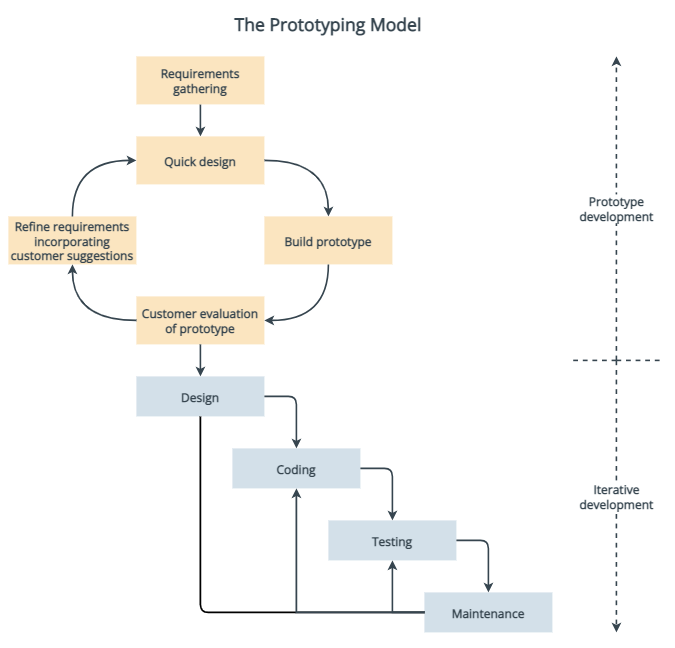
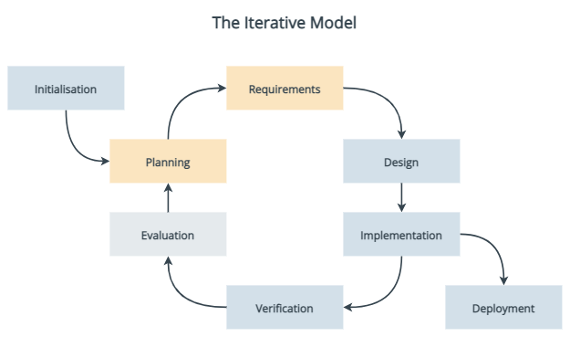
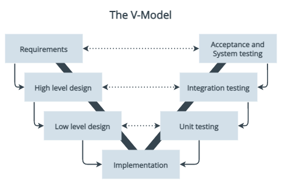

<!-- # Training 04 - Agile & Lean -->
# Software development lifecycle (SDLC) methods

## Waterfall development model

Introduced in 1970, and the primary SDLC used until the 1990s, the waterfall approach to software development uses distinct phases sequentially, commonly:

1. Requirements specification
1. System design
1. Implementation
1. Verification and testing
1. Deployment and maintenance.

The output of each phase is input for the next phase, and phases do not overlap. No phase ends until all phase deliverables are produced, and the process receives approval from defined stakeholders to proceed. Like water flowing down a waterfall, the workflow through the phases should be one-way.

### Projects suitable for Waterfall

Projects that:
* have clear requirements that will not change
* are small in scope that will not change.

### Waterfall phases

#### Requirements

All project requirements must be gathered and outlined in writing. The output from this phase is generally a single requirement specifications document, that describes each stage of the project, including costs, assumptions, risks, dependencies, success metrics, and timelines. Once the requirements are approved by the required stakeholders, they shouldn't change.

#### Design

Using the product requirements, a system design is created. Architectures, solution designers, and developers design how the system will be built. A higher-level design is created first,  describing the flow of traffic between components, and integration points. Then a low-level design is created that specifies hardware and software technologies.

#### Implementation

Software developers create the code of the application. They usually develop in small sections called units, and each unit is also tested during this phase.

#### Verification or testing

Testing is done to ensure there are no errors, performance issues, security problems, and all the requirements have been met.

#### Deployment and maintenance

The software is deployed to customers. If defects are found or there are change or enhancement requests, there may be updates and new versions of the software that need to be created and released.

If an enhancement is large in scope, then the Waterfall process might begin again.

### Advantages of Waterfall

* Simple and well-defined methodology.
* Simple to manage and schedule in advance.
* Simple to measure progress using clearly defined milestones.
* After the requirements have been defined, the timeline and cost of the project can be accurately estimated.
* During the analysis and design phases developers can catch design errors, avoiding writing incorrect code during the implementation phases.
* Software developers joining a project in progress can get up to speed quickly because everything is outlined.
* Customers should not add new requirements, which would cause delays.

### Disadvantages of Waterfall

* High risk and uncertainty in projects that are medium, large, or complex.
* No working software until late in the process.
* In practice requirements often do change, which can become time-consuming, and costly.
* Does not allow for reflection or revision of design once implementation begins.
* May take longer to deliver then using an iterative approach, such as the Agile method.
* Clients may not fully know what they want from the beginning.
* Clients are not involved in the design and implementation phases.
* Deadline creep can occur when one phase is delayed, delaying future phases.

### More information on Waterfall

For more information on the Waterfall method of software development, see:
* [Waterfall Methodology](https://www.workfront.com/project-management/methodologies/waterfall) by Adobe Workfront
* [Waterfall model](https://en.wikipedia.org/wiki/Waterfall_model) on Wikipedia

## Prototyping model

One of the earliest alternatives to Waterfall in the mid-1970s, the Prototype method involved the creation of a low fidelity prototype to collect early feedback from users. With the feedback, the prototype is evolved into the final software.

## Iterative model

An early precursor to Agile, reportedly used as part of NASA's Project Mercury in the early 1960s. It emphasises iterative and incremental action. Only the major requirements are known from the beginning, and a quick and cheaper first version of the software is created. Then, as more requirements are identified, the software is iteratively designed and built. Each iteration gives through the entire lifecycle, and it was common for the team be working on several phases at the same time.

## Spiral model

Introduced in 1988, the Spiral model combines aspects of Waterfall and rapid prototyping. The basic principles are:
* Focus on minimising project risk by breaking the project into small parts.
* Cycle through the process following the same steps each time.
* Begin each trip around the spiral by identifying stakeholders and the 'win conditions'.
* End each cycle with review and commitment.
* Each trip around the spiral goes through:
    1. Determine objects, alternatives, and constraints of the iteration.
    1. Evaluate alternatives, and identify and resolve risks.
    1. Develop and verify deliverables from the iteration.
    1. Plan the next iteration.

For more information, go to [Spiral development](https://en.wikipedia.org/wiki/Software_development_process#Spiral_development) on Wikipedia.

## V-Model

Introduced in 1991, the V-Model method (also known as the Verification and Validation model) is non-linear and has a testing phase for each development phase.

For more information, go to [V-Model](https://en.wikipedia.org/wiki/V-Model_(software_development)) on Wikipedia, or [SDLC V-Model](https://www.geeksforgeeks.org/software-engineering-sdlc-v-model/) on GeeksforGeeks.

## Incremental build model

The Incremental build model applies the waterfall method incrementally.

For more information, go to [Incremental development](https://en.wikipedia.org/wiki/Software_development_process#Incremental_development) on Wikipedia, or [Incremental process model](https://www.geeksforgeeks.org/software-engineering-incremental-process-model/) on GeeksforGeeks.

## Waterfall-Agile Hybrid model

The hybrid approach defines the project up-front like a Waterfall method, but then moves to an Agile approach for design, development and testing.

For information go to [Blending Agile and Waterfall](https://www.pmi.org/learning/library/blending-agile-waterfall-successful-integration-10213) by the Project Management Institute.

## Agile development model

In 2001, [17 people got together to discuss the need for an alternative to documentation-driven, heavyweight software development process](https://agilemanifesto.org/history.html) and together they created the [Agile Manifesto](https://agilemanifesto.org/).

### Agile misconceptions

### Benefits

#### Benefits for the development team

#### Benefits to the business

### Agile methodologies
Other methodologies Lean, Kanban, DSDM and Krystal

#### Extreme programming
Explanation and history
Activities
Principles
Values
Rules

#### Scrum
Explanation and history
Key concepts:
Values
Roles
Artifacts
Activities

## Introductory References

### Articles

- Agile
  - [Manifesto for Agile Software Development](https://agilemanifesto.org/)
  - [Agile Software Guide](https://martinfowler.com/agile.html)
- Scrum
  - [What is scrum?](https://www.scrum.org/resources/what-is-scrum)

## Agile Development information from to-sort

  - [Agile Development: A quick overview](https://medium.com/theagilemanager/a-quick-overview-to-agile-5c87ffc9e0f2)
  - [Agile Development: User stories are the new requirements document](https://medium.com/theagilemanager/agile-development-user-stories-are-the-new-requirements-document-c105947c9291)
  - [Agile Development: What is a Scrum Master? Roles and Responsibilities?](https://medium.com/swlh/agile-development-what-is-a-scrum-master-roles-and-responsibilities-566129d13170)
  - [Story Points — You’re Doing Them Wrong](https://medium.com/better-programming/story-points-youre-doing-them-wrong-7d03d8de0696)
  - [Agile Development: What is a Product Owner? Roles and Responsibilities?](https://medium.com/swlh/agile-development-what-is-a-product-owner-roles-and-responsibilities-4aa2d2d8c7dd)
  - [Here’s Why Many Developers Hate Scrum](https://medium.com/serious-scrum/here-is-why-many-developers-hate-scrum-3a43baa015d1)
  - [The 5 Benefits of Having an Extended Development Team](https://medium.com/better-programming/the-5-benefits-of-having-an-extended-development-team-f5960a9a0fa0)
  - [How do Product Owners deliver value without actually building anything?](https://medium.com/serious-scrum/how-do-product-owners-deliver-value-without-actually-building-anything-6fb64eaa5ef7)
  - [A Guide To Writing Effective User Stories](https://medium.com/@george_wilde/a-guide-to-writing-effective-user-stories-658823dec2e0)
  - [Setting up a product backlog management process using Jira](https://medium.com/@sergiialekseev/setting-up-a-product-backlog-management-process-using-jira-252da2ab133a)

### Books

- Agility
  - [A Seat at the Table](https://learning.oreilly.com/library/view/a-seat-at/9781457191411/) – by Mark Schwartz
- Lean
  - [The Lean Startup](https://www.amazon.com.au/Lean-Startup-Entrepreneurs-Continuous-Innovation/dp/B00NPB3THW/ref=sr_1_1?dchild=1&keywords=lean+startup&qid=1601904066&sr=8-1) - by Eric Ries

### Video Playlists

## Technologies
