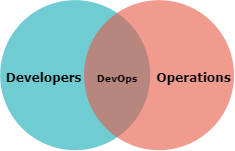
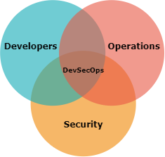

<!-- # Training 07 - DevSecOps and Continuous Delivery Pipelines -->

> The employment of DevOps practices and utilisation of Continuous Delivery Pipelines underpin the current approaches to delivery new features to end users with a high quality and velocity.

# DevOps

Traditional methods of software development involved a big release approach, called Waterfall. Many features were developed over months, even years, and when finally ready for release the work moved to the operations teams for release.

The big release approach was development (dev), then operations (ops).

Modern software development practices have evolved to a quick release approach. This involves a single feature, or a few features, being developed within a few hours or a day. To be able to release this software as fast as it's being developed, development needs to work closely with operations.

The quick release approach requires development (dev) and operations (ops) to work closely together. This is why it's called DevOps.

DevOps is more than just dev and ops. It's a culture, and a set of processes and practices that consider and optimise the entire software development chain end-to-end. It considers customer needs, stakeholder goals, business analysis, development, validation, operations, education and more.

It's an approach that prioritises getting the software into the hands of the users as fast as possible, so they benefit sooner.

It applies automation where it's beneficial, reducing manual handling and human error. It simplifies how you prioritise work, as you always focus on doing the most valuable thing. It allows singular focus, doing less and getting it done before moving to the next thing. It increases flexibility to adapt to a changing landscape, and customer needs.

## DevSecOps

DevSecOps is DevOps, plus the integration of security at all stages in the software development.

## Continuous Integration and Delivery (CI/CD)
Continuous integration (CI) and continuous delivery (CD) are modern software development practices used in DevOps. Together they form a process known as the CI/CD pipeline.

The CI/CD pipeline aims to deliver software updates more frequently. It manages automated builds, tests, and deployments into one release workflow.

### Continuous Integration (CI)

CI forms the first part of the CI/CI pipeline, and is a process with:
1.	Developers frequently integrating their code into a central repository.
1.	Frequent automated code building.
1.	Frequent automated code testing.
1.	Frequent pushing of artefacts into repositories for deployment.

#### Benefits of CI

CI offers higher quality software through reduced costs and increased flexibility.

##### Reduced costs

* Integrating code is easier
* Issues come up earlier
* Issues are easier to troubleshoot, needing less time to resolve
* Automation results in fewer issues and increased efficiency

##### More flexibility

* The entire process is visible to everybody involved
* Improved team communication
* Shorter feedback loop
* Delivering software to operations faster and more often means potentially more frequent releases, resulting in:
  * being quicker to market
  * reacting faster to customer needs

### Continuous Delivery

CD forms the second part of the CI/CD pipeline, and is a process where:
1. Deployment can be manually started, or on a schedule.
1. Built artifacts from CI are automatically deployed to various environments, and tested, following the deployment process.

Continuous deployment (sometimes also called CD) is the same practice, except that the deployment (even to production) is  automated.

#### Benefits of CD

CD offers higher quality software through reduced human error and increased flexibility.

##### Less risky

* Automated deployment process removes human error

##### More flexibility

* Potentially more frequent releases, resulting in:
  * being quicker to market
  * reacting faster to customer needs

## References

### Articles

- Dev(Sec)Ops
  - [What is DevOps?](https://theagileadmin.com/what-is-devops/)
  - [What is DevSecOps?](https://www.redhat.com/en/topics/devops/what-is-devsecops)
  - [DevOpsCulture](https://www.martinfowler.com/bliki/DevOpsCulture.html)
- Continuous Integration_Continous Delivery (CI_CD)
  - [Continuous Integration | Martin Fowler](https://martinfowler.com/articles/continuousIntegration.html)
  - [Continuous Integration | ThoughWorks](https://www.thoughtworks.com/continuous-integration)
  - [Continuous Delivery | Martin Fowler](https://www.martinfowler.com/bliki/ContinuousDelivery.html)

### Books

- [The DevOps Handbook](https://learning.oreilly.com/library/view/the-devops-handbook/9781457191381/) - by Gene Kim, Jez Humble, Patrick Debois and John Willis
- [The Phoenix Project](https://learning.oreilly.com/library/view/the-phoenix-project/9781457191350/) – By Gene Kim, Kevin Behr and George Spafford
- [The Unicorn Project](https://learning.oreilly.com/library/view/the-unicorn-project/9781098124175/) – by Gene Kim
- [Continuous Integration vs. Continuous Delivery vs. Continuous Deployment](https://learning.oreilly.com/library/view/continuous-integration-vs/9781492088943/)

### Video Playlists

## Technologies

## Benefits of Continuous Delivery Pipeline (CDP)

> The CDP represents the workflows, activities, and automation needed to shepherd a new piece of functionality from ideation to an on-demand release of value to the end user.

### Continuous Delivery Foundation

> The [Continuous Delivery Foundation](https://cd.foundation) (CDF) serves as the vendor-neutral home of many of the fastest-growing projects for continuous integration/continuous delivery (CI/CD). It fosters vendor-neutral collaboration between the industry’s top developers, end users and vendors to further CI/CD best practices and industry specifications. Its mission is to grow and sustain projects that are part of the broad and growing continuous delivery ecosystem.

Similarly to the Clound Native Computing Foundation landscape, the Continuous Delivery Foundation offers its own [interactive landscape](https://landscape.cd.foundation/).

### Continuous Integration

- Continous Integration

  - [GitLab CI](https://about.gitlab.com/)
  - [Jenkins](https://www.jenkins.io/)

- Continuous Delivery

  - [Continous Delivery Foundation](https://cd.foundation/)
  - [Helm](https://helm.sh/)
