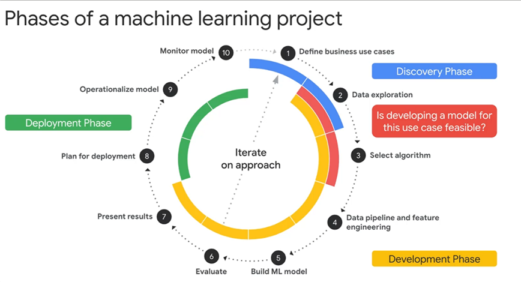

<!-- # Training 08 - Architecture (Data and AI) -->

## Introductory References

### Articles

- Data Architectures
  - [How to Move Beyond a Monolithic Data Lake to a Distributed Data Mesh](https://martinfowler.com/articles/data-monolith-to-mesh.html)
  - [Data Mesh Paradigm Shift in Data Platform Architecture](https://www.youtube.com/watch?v=52MCFe4v0UU)

### Books

- [Competing in the Age of AI](https://learning.oreilly.com/library/view/competing-in-the/9781633697638/) - by Marco Iansiti, Karim R. Lakhani

### Video Playlists

### Resources

- [The ModelOps and MLOps Resource Hub](https://modelop.io)

## Technologies

## MLOps (Machine Learning Operations)

### Executive summary

MLOps is a combination of philosophies and practices that enable data science and IT operations teams to rapidly develop, deploy, maintain and scale Machine Learning models.

MLOps is derived from DevOps principles. The name MLOps is a combination of Machine Learning (ML) and operation (Ops). MLOps is a subset of ModelOps.

"MLOps or ML Ops is a set of practices that aims to deploy and maintain machine learning models in production reliably and efficiently." [Wikipedia](https://en.wikipedia.org/wiki/MLOps).

Applying these practices of continuous improvement, collaboration, communication, and embracing automation improves product quality, simplifies management, and increases speed of delivery.

### Overview

MLOps is an approach to machine learning operations that considers and streamlines the entire process. The goal of MLOps is to manage resources, data, code, time and quality to meet business objectives and regulatory concerns.

Continuous integration (CI) and continuous delivery (CD) from DevOps are important processes in MLOps. However, there are some differences. To create a complete pipeline for MLOps, we introduce an additional discipline: Continuous training.

|  | DevOps | MLOps |
|---|---|---|
| Continuous Integration | Test and validate code and components. | Also test and validate data, data schemas, and models. |
| Continuous Deployment | Focus on a single software package or service. | Also consider the whole system: the ML training pipeline that should automatically deploy another service, or roll back changes from a model. |
| Continuous Training |  | Constantly monitor, retrain, and serve the model. |

#### Machine Learning Lifecycle

1. Data gathering/extraction
1. Data analysis
1. Data transformation/preparation
1. Model training & development
1. Model evaluation
1. Model validation
1. Model serving
1. Model monitoring
1. Model re-training

### Problems MLOps attempts to solve

It can be difficult to:

* track trained models.
* track all the different versions of code, values, and metrics.
* track which ideas have been tried, and the outcomes.
* reproduce the best model, and easily put it into production.

### Benefits and risks

Streamlining the entire machine learning process and introducing automation improves team performance and enables greater agility, while maintaining work quality. It also supports efficiency when updating a production model as new data comes in.

### MLOps tools

About the available tools:

* [Linux Foundation AI & Data Foundation Interactive Landscape](https://landscape.lfai.foundation/).
* [The Best MLOps Tools and How to Evaluate Them](https://neptune.ai/blog/best-mlops-tools).
* [The Best Tools, Libraries, Frameworks and Methodologies that Machine Learning Teams Actually Use – Things We Learned from 41 ML Startups [ROUNDUP]](https://neptune.ai/blog/tools-libraries-frameworks-methodologies-ml-startups-roundup).
* [TWIML Enterprise ML and AI Solutions Guide](https://twimlai.com/solutions/).

Google Cloud:

* [MLOps: Continuous delivery and automation pipelines in machine learning](https://cloud.google.com/architecture/mlops-continuous-delivery-and-automation-pipelines-in-machine-learning).
* [Architecture for CI/CD and ML Pipelines using Kubeflow and Cloud Build](https://cloud.google.com/solutions/machine-learning/architecture-for-mlops-using-tfx-kubeflow-pipelines-and-cloud-build).
* [GitOps-style continuous delivery with Cloud Build](https://cloud.google.com/kubernetes-engine/docs/tutorials/gitops-cloud-build).
* [Setting up a CI/CD pipeline for your data-processing workflow](https://cloud.google.com/solutions/cicd-pipeline-for-data-processing).
* Watch the [MLOps Best Practices on Google Cloud (Cloud Next '19)](https://www.youtube.com/watch?v=20h_RTHEtZI) (53:20) on YouTube.
* [Discover reference architectures, diagrams, design patterns, guidance, and best practices for building or migrating your workloads on Google Cloud](https://cloud.google.com/architecture?category=aiandmachinelearning).

Amazon web services:

* [Amazon SageMaker for MLOps Engineers](https://aws.amazon.com/sagemaker/mlops/).

Microsoft Azure:

* [Machine learning operations (MLOps)](https://azure.microsoft.com/en-us/services/machine-learning/mlops/).

GitHub:

* [How to Build MLOps Pipelines with GitHub Actions [Step by Step Guide]](https://neptune.ai/blog/build-mlops-pipelines-with-github-actions-guide).

### Learn more

Useful resources to learn more about MLOps
* [Information on MLOps by INNOQ](https://ml-ops.org/).
* [MLOps: What It Is, Why It Matters, and How to Implement It](https://neptune.ai/blog/mlops).
